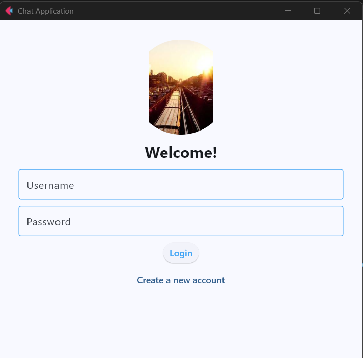
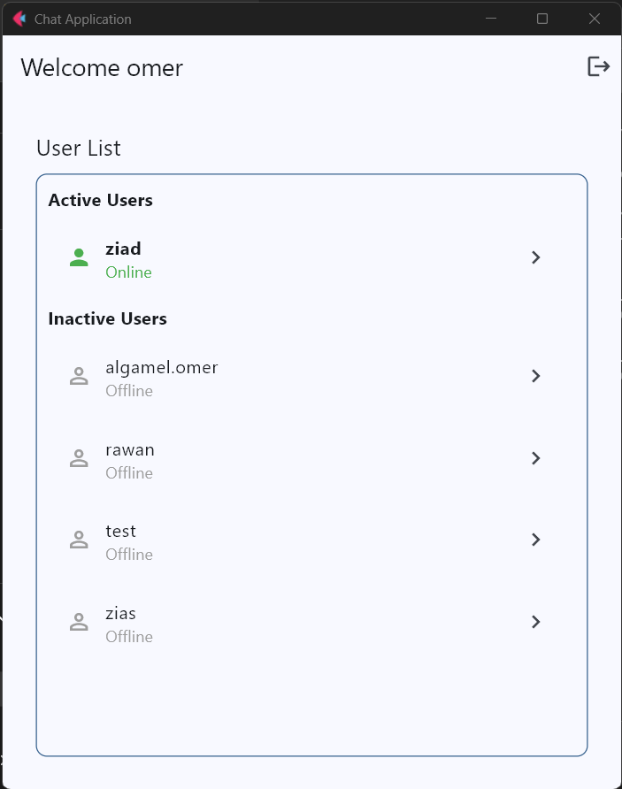

# Chat Server Python

A cross-platform real-time chat application built with Python. It features a socket-based server and a modern GUI client powered by [Flet](https://flet.dev/), enabling users to register, log in, and engage in one-on-one conversations with chat history support.




---

## Features

* **User Authentication**: Secure registration and login using SHA-256 password hashing.
* **Real-Time Messaging**: Instant one-on-one messaging with active user status indicators.
* **Chat History**: Persistent message storage using SQLite, allowing users to view past conversations.
* **Modern GUI**: Responsive and intuitive interface built with Flet, ensuring a seamless user experience across platforms.
* **Cross-Platform Support**: Compatible with Windows, macOS, and Linux.

---

## Installation

### Prerequisites

* Python 3.9 or higher.
* `pip` package manager.([PyPI][1])

### Clone the Repository

```bash
git clone https://github.com/algamelomer/chat-server-python-.git
cd chat-server-python-
```


### Set Up a Virtual Environment (Optional but Recommended)

```bash
python -m venv venv
# Activate the virtual environment:
# On Windows:
venv\Scripts\activate
# On Unix or macOS:
source venv/bin/activate
```


### Install Dependencies

```bash
pip install flet
```


---

## Running the Application

### Start the Server

```bash
python chat_server.py
```


The server will start and listen on `localhost:12345`.

### Launch the Client

```bash
python chat_client.py
```


The client application will open in a native OS window.([Flet][2])

---

## Usage

1. **Register**: Click on "Create a new account" and provide a unique username and password.
2. **Login**: Enter your credentials to log in.
3. **User List**: View active and inactive users.
4. **Chat**: Select a user to start a conversation. Messages will be stored and can be viewed later.
5. **Logout**: Click the logout icon to end your session.([Anaconda][3])

---

## Code Overview

### `chat_server.py`

Handles server-side operations, including user authentication, message routing, and database interactions.

* **Database Setup**: Initializes SQLite database with `users` and `messages` tables.
* **Password Hashing**: Uses SHA-256 to securely store passwords.
* **Client Handling**: Manages multiple client connections using threading.
* **Commands**:

  * `LOGIN <username> <password>`: Authenticates a user.
  * `REGISTER <username> <password>`: Registers a new user.
  * `SEND <recipient> <message>`: Sends a message to another user.
  * `GET_HISTORY <user>`: Retrieves chat history with a specific user.
  * `GET_ALL_USERS`: Returns a list of all registered users and their online status.

### `chat_client.py`

Implements the client-side GUI and handles user interactions.

* **Flet Integration**: Utilizes Flet to build a responsive GUI.
* **User Interface**:

  * **Login/Register Views**: Forms for user authentication.
  * **User List View**: Displays active and inactive users.
  * **Chat View**: Interface for sending and receiving messages.
* **Message Handling**: Receives and processes messages from the server in real-time.
* **Routing**: Manages navigation between different views based on user actions.([Flet][4])

---

## Screenshots

### Login Screen


### Chat Interface


---

## License

This project is licensed under the [MIT License](LICENSE).

